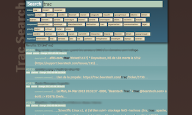

Trac Search
===========

Bring the modernity of Elastic Search to the classical Trac.

Trac is a nice tool, but it search engine is confusing.

Install it
----------

Create a nice virtualenv.

    pip install -r requirements.txt

Try it
------

Launch a local elastic.

Configure

    cp tracsearch.ini.sample tracsearch.ini
    vim tracsearch.ini

Index some tickets

    ./index_ticket.py

Launch the web application

    python web.py

Deploy it
---------

Use supervisord to launch the web application.
Use the source folder as virtualenv folder.

Edit _/etc/supervisor/conf.d/tracsearch.conf_

    [program:tracsearch]
    user=tracsearch
    command=/opt/tracsearch/bin/python web.py
    directory=/opt/tracsearch
    environment=PATH="/opt/tracsearch/bin"

For now, there is no automatic indexation.

Todo
----

 - √ Index ticket and comment
 - _ Index wiki
 - √ Web UI
 - √ Time line
 - _ Multiple Trac
 - _ Trac module to live index
 - _ Redmine variant

Licence
-------

BSD © Mathieu Lecarme 2013
